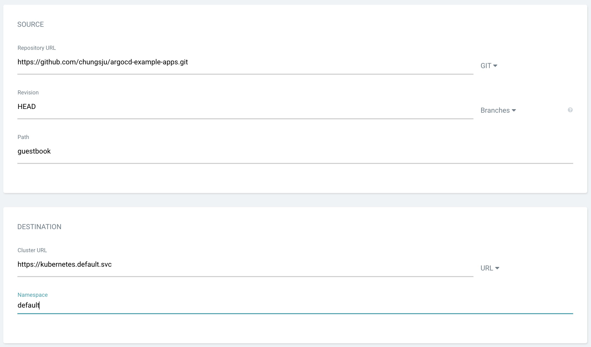
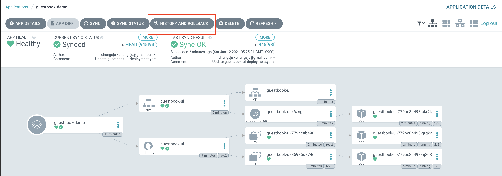
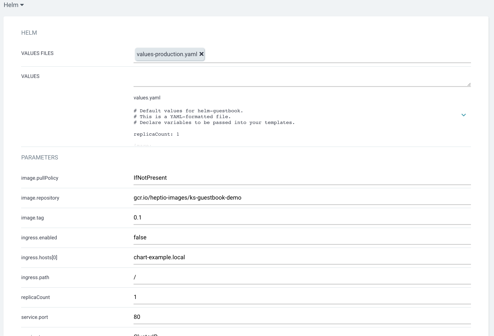

# Learning Kubernetes

[toc]

## 17. Skaffold

### 17.1 Skaffold 설치

각 클라이언트 OS환경에 맞는 바이너리 파일을 다운 받습니다.
https://skaffold.dev/docs/install/

### 17.2 Skaffold 샘플 소스 다운

```
git clone https://github.com/chungsju/skaffold-nodejs.git
```

### 17.3 Docker Hub에 repository 생성

Docker hub에 로그인 후 repository 생성
https://hub.docker.com/repositories

skaffold-nodejs 혹은 별도의 이름으로 repository생성

### 17.4 Skaffold init 실행

kubernetes-manifests/hello.deployment.yaml 파일의 컨테이너 image: chungsju/skaffold-nodejs 이미지 이름을 각자의 Docker hub repository이름으로 변경

```
skaffold init
# 빌드 타입은 Docker를 선택
? Choose the builder to build image chungsju/skaffold-nodejs  [Use arrows to move, type to filter]
  Buildpacks (package.json)
> Docker (Dockerfile)
  None (image not built from these sources)

# Skaffold.yaml 파일 자동 생성
? Which builders would you like to create kubernetes resources for?
apiVersion: skaffold/v2beta21
kind: Config
metadata:
  name: skaffold-nodejs
build:
  artifacts:
  - image: chungsju/skaffold-nodejs
    docker:
      dockerfile: Dockerfile
deploy:
  kubectl:
    manifests:
    - kubernetes-manifests/hello.deployment.yaml
    - kubernetes-manifests/hello.service.yaml

? Do you want to write this configuration to skaffold.yaml? (y/N)  
```

> skaffold.yaml 이 자동 생성된 것을 확인합니다.

### 17.5 Skaffold dev

```
skaffold dev
```
> Docker 이미지 생성 및 Docker push, Kubernetes 리소스 생성을 확인합니다.

### 17.6 nodejs 소스 변경

src/index.js 파일을 수정 및 저장 ( console.log 부분을 수정하고 저장)
```
console.log(
    'My Skaffold Test,,,,Hello! The container started successfully and is listening for HTTP requests on $PORT'
  );
```
> skaffold를 통해 파일 변경을 감지하고 자동으로 Kubernetes에 새로운 서비스를 배포하는 것을 확인합니다.


##  18. ArgoCD

### 18.1 ArgoCD 클러스터 설치


- argocd 설치

```{bash}
kubectl create namespace argocd
kubectl apply -n argocd -f https://raw.githubusercontent.com/argoproj/argo-cd/stable/manifests/install.yaml

kubectl patch svc argocd-server -n argocd -p '{"spec": {"type": "LoadBalancer"}}'
```

- 패스워드 알아내기

```{bash}
kubectl -n argocd get secret argocd-initial-admin-secret -o jsonpath="{.data.password}" | base64 -d
```
> 위의 모든 과정은 Heml Chart를 통해서도 설치 가능합니다.
> helm repo add argo https://argoproj.github.io/argo-helm
>
> helm install my-argo-cd argo/argo-cd --set server.service.type=LoadBalancer

- 로드벨런서 주소 얻은 후 브라우저로 로그인
```{bash}
kubectl get svc argocd-server -n argocd
```

- 유저 : admin , 패스워드 : 위의 secret을 통해 얻은 password

### 18.2 배포대상에 대한 Git 리포지토리 만들기

- Github에 로그인

- Argo CD를 연습하기 위한 샘플 Git 리포지토리 내 Git 리포지토리로 Fork

https://github.com/argoproj/argocd-example-apps


### 18.3 ArgoCD 와 Git 리포지토리 연동

- NEW APP 등록
  

- 위에서 Fork된 본인의 Git URL과 배포 Destination 등록

  

### 18.4 SynC 하기


### 18.5 Github의 guestbook/guestbook-ui-deployment.yaml파일 수정 및 커핏

replicas : 3

image: gcr.io/heptio-images/ks-guestbook-demo:0.1 으로 수정


### 18.6 Sync 하기
- Git저장소 변경으로 인한 OutOfSync 상태

  

- Sync 하기

### 18.7 Rollback 하기



### 18.8 helm chart 등록


- 배포하고자 하는 helm value 파일 선택



### 18.9 <연습문제> wordpress helm chart를 Argo CD를 통해 배포하기

- helm chart 오프라인 다운받기
```{bash}
helm fetch bitnami/wordpress
```

- 압축풀기
- Git에 올리기
- Argo CD에 연동하기